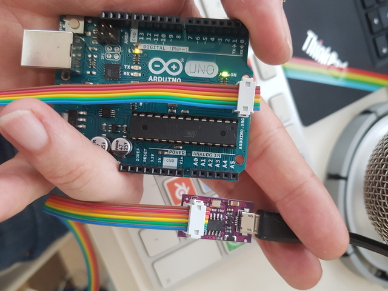
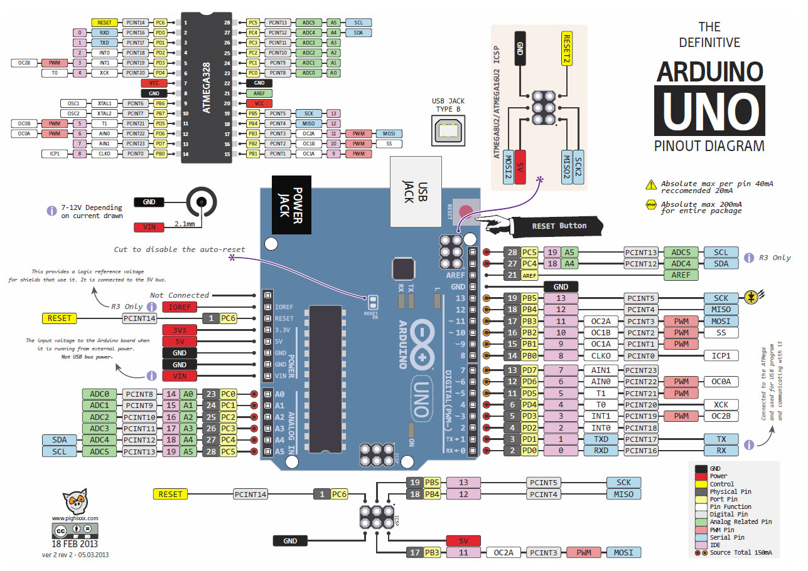

# Assembly with arduino board

## Get ready

- Install `avrdude` and get `avra` or `gavrasm` assembler
- Connect the Arduino board to the usbtiny programmer as shown in the picture below.

- Compile the program `gavrasm hello.asm`
- Upload the `hex` file `sudo avrdude -p m328p -P usb -c usbtiny -U flash:w:hello.hex`

## Arduino pinout



## Hacking the microcontroller

### Reading info from the microcontroller

You can obtain info about the microcontroller with `sudo avrdude -p m328p -P usb -c usbtiny -v`. Like the memory detail:

```

                                  Block Poll               Page                       Polled
           Memory Type Mode Delay Size  Indx Paged  Size   Size #Pages MinW  MaxW   ReadBack
           ----------- ---- ----- ----- ---- ------ ------ ---- ------ ----- ----- ---------
           eeprom        65    20     4    0 no       1024    4      0  3600  3600 0xff 0xff
           flash         65     6   128    0 yes     32768  128    256  4500  4500 0xff 0xff
           lfuse          0     0     0    0 no          1    0      0  4500  4500 0x00 0x00
           hfuse          0     0     0    0 no          1    0      0  4500  4500 0x00 0x00
           efuse          0     0     0    0 no          1    0      0  4500  4500 0x00 0x00
           lock           0     0     0    0 no          1    0      0  4500  4500 0x00 0x00
           calibration    0     0     0    0 no          1    0      0     0     0 0x00 0x00
           signature      0     0     0    0 no          3    0      0     0     0 0x00 0x00
```

The current fuse values:

```
avrdude: safemode: hfuse reads as D6
avrdude: safemode: efuse reads as FD
avrdude: safemode: Fuses OK (E:FD, H:D6, L:FF)
```

### Download the flash content

`sudo avrdude -p m328p -P usb -c usbtiny -U flash:r:program.dump:i`. Note that `program.dump` must exist. `i` stands for intel hex format. Check avrdude for more info.

### Download the eeprom content

`sudo avrdude -p m328p -P usb -c usbtiny -U eeprom:r:memory.eep:h`. Note that `memory.eep` must exist
